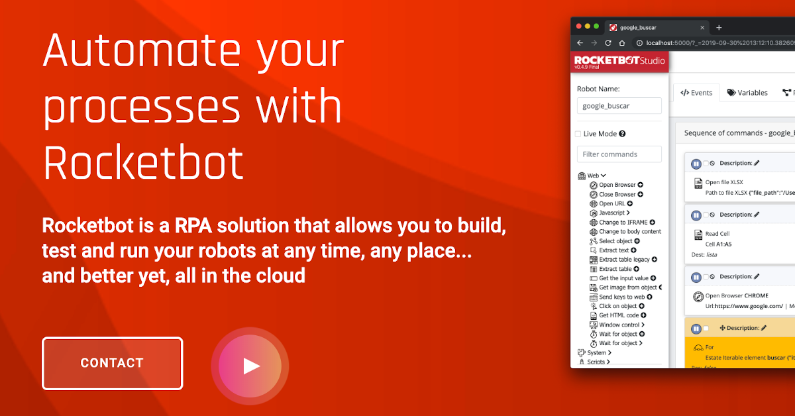

# AcceptAlert
  
Módulos para aceptar o rechazar una alerta en el navegador  
  

## How to install this module
  
__Download__ and __install__ the content in 'modules' folder in Rocketbot path  

## Description of the commands

### AcceptAlert
  
Confirm o dismiss an alert
|Parameters|Description|example|
| --- | --- | --- |
|Option|||
|Send text||Text|
|Save text||Variable|

### Wait Alert
  
Wait for an alert the defined seconds
|Parameters|Description|example|
| --- | --- | --- |
|Seconds||5|
|Assign result to variable||Variable|
