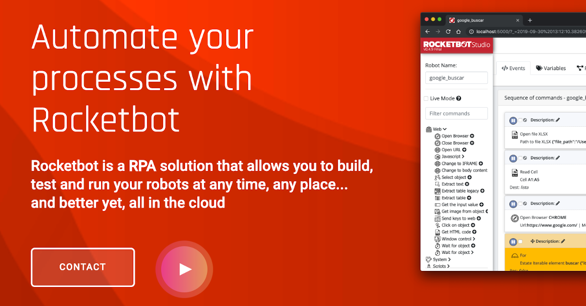

# AcceptAlert
  
Módulos para aceptar o rechazar una alerta en el navegador  
  

## Como instalar este módulo
  
__Baixe__ e __instale__ o conteúdo na pasta 'modules' no caminho do Rocketbot  

## Descrição do comando

### AcceptAlert
  
Confirmar ou descartar um alerta
|Parâmetros|Descrição|exemplo|
| --- | --- | --- |
|Option|||
|Mande texto||Texto|
|Salvar text||Variável|

### Aguarde Alerta
  
Aguarde um alerta os segundos definidos
|Parâmetros|Descrição|exemplo|
| --- | --- | --- |
|Segundos||5|
|Atribuir resultado à variável||Variável|
